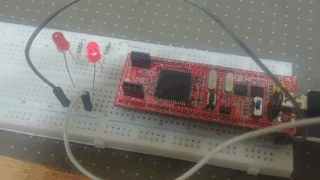
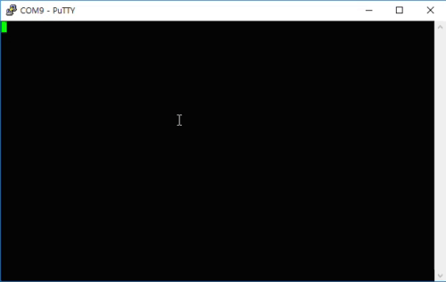

# ATMega128 Simple FreeRTOS project

This repository uses the [ATMega128 embedded board](http://www.devicemart.co.kr/goods/view?no=32749&NaPm=ct%3Djxr7itzj%7Cci%3Dcheckout%7Ctr%3Dppc%7Ctrx%3D%7Chk%3D5152996465a38d046904b5ddd92334f551f6ac6e)
which is great to learn about the embedded board system.
I use the below picture's embedded board.

This project not only uses ATMega128 but also uses [FreeRTOS](https://www.freertos.org/) which is the best open source real-time operating system.
If you want to find the specific function, then I strongly recommend this repository's tags.

## LED Example(tags: LED_example)

This uses PD0 and PD1. One blinks every 500ms and the other blinks every 1s program. When you run this program. You have to add the driver folder to your project properties include setting!

## USART Example(tags: USART_example)

This uses PD2(RX) and PD3(TX). You can change the options in the `usart.h` and `usart.c`. Unfortunately, this example doesn't support any kinds of the queue which stores your input. So, you have to set your delay time as I do in `main.c` files.

In this example, I use the PL2303HX USB to TTL converter module.

I recommend the [Putty](https://www.chiark.greenend.org.uk/~sgtatham/putty/) to communicate with ATMega128 by serial. I think [this site](https://www.techwalla.com/articles/how-to-send-a-serial-command-line) can help you to set up the communication between Putty and ATMega128 machine. If you connect correctly, then you can see the image like below.

